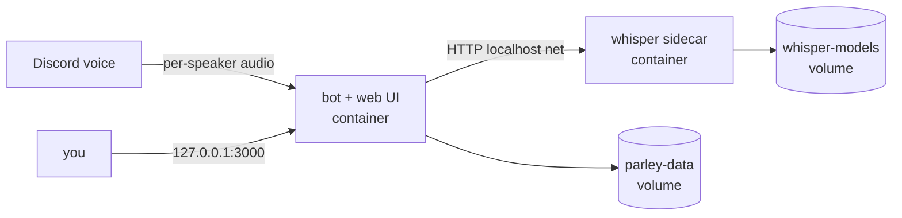

<p align="center">
  
</p>

<p align="center">
  <b>Parley</b> records your Discord voice meetings, transcribes them per-speaker on your own machine,
  and posts structured AI meeting notes straight into a thread.
</p>

<p align="center">
  = 22.5" />
  
  
  
  
</p>

<p align="center">
  <a href="https://sakethkanchi.github.io/parley-landing/"><b>🌐 Website</b></a> ·
  <a href="#-demo"><b>🎬 Demo</b></a> ·
  <a href="#-the-web-dashboard"><b>🖥️ Dashboard</b></a> ·
  <a href="#-quick-start-docker"><b>🐳 Quick start</b></a> ·
  <a href="#-installation"><b>🚀 Install</b></a> ·
  <a href="#-commands"><b>💬 Commands</b></a> ·
  <a href="#-privacy--consent"><b>🔒 Privacy</b></a>
</p>

---

## 🎬 Demo

<p align="center">
  <a href="https://streamable.com/joqv9e">
    
  </a>
</p>

<p align="center">
  <a href="https://streamable.com/joqv9e"><b>▶ Watch the 20s demo</b></a>
</p>

<p align="center">
  <i>A live voice meeting becomes a per-speaker transcript, then structured notes — TL;DR, decisions, action items, talk-time — posted to a thread. All transcribed locally.</i>
</p>

---

## 🖥️ The web dashboard

Notes land in Discord, but the **self-hosted web admin** is where you live with them: browse every meeting, read full notes, work the action-item list, watch talk-time analytics, search transcripts, and configure the bot from the browser. Dark by default, light when you want it.

<p align="center">
  
</p>

<table>
  <tr>
    <td width="50%"></td>
    <td width="50%"></td>
  </tr>
  <tr>
    <td align="center"><b>Meetings</b> — every recording, with a TL;DR and talk-time split per card</td>
    <td align="center"><b>Notes</b> — topics, decisions, open questions, and action items per meeting</td>
  </tr>
  <tr>
    <td width="50%"></td>
    <td width="50%"></td>
  </tr>
  <tr>
    <td align="center"><b>Analytics</b> — meetings per day, talk-time and word leaderboards</td>
    <td align="center"><b>Search</b> — full-text across every transcript, jump to the moment</td>
  </tr>
  <tr>
    <td width="50%"></td>
    <td width="50%"></td>
  </tr>
  <tr>
    <td align="center"><b>Action items</b> — a live to-do list from every meeting, filterable by person</td>
    <td align="center"><b>Light mode</b> — an equally polished alternative</td>
  </tr>
</table>

> Screenshots use a demo server with fictional data. The dashboard ships with the bot — `npm run web:build` once, then `npm start` (see [Running](#-running)). With Docker it's already running.

---

A fully self-hosted alternative to Otter/Fathom/Fireflies, built for Discord. Audio is transcribed locally — only the final transcript text ever leaves your machine (to the summarizer you choose, or nowhere at all if you run a local model). No SaaS account, no per-seat pricing, no cloud recording.

## Table of contents

- [Demo](#-demo)
- [The web dashboard](#-the-web-dashboard)
- [Features](#-features)
- [How it works](#-how-it-works)
- [Quick start (Docker)](#-quick-start-docker)
- [Deploy with Portainer](#-deploy-with-portainer)
- [Where to host it](#-where-to-host-it)
- [Prerequisites](#-prerequisites)
- [Installation](#-installation)
- [Running](#-running)
- [Commands](#-commands)
- [Configuration](#-configuration)
- [Supported summarizers](#-supported-summarizers)
- [Privacy & consent](#-privacy--consent)
- [Development](#-development)
- [Contributing](#-contributing)
- [License](#-license)

## ✨ Features

- **Per-speaker transcripts, no ML diarization.** Discord delivers a separate audio stream per user, so every utterance is attributed to the right person exactly — not guessed.
- **Structured AI notes.** TL;DR, topic sections, decisions, open questions, and **action items grouped by the person responsible**, plus per-speaker talk-time stats.
- **Full web dashboard.** A local control panel to browse meetings, read notes, work the action-item list, see talk-time analytics, search transcripts, and configure everything. Connect your Discord bot and edit settings right from the browser — no editing files.
- **Live view.** Watch in-progress recordings from the dashboard — who's in the room, elapsed time, one-click stop — and see the meeting move to a **Processing** state while it's transcribed and summarized, until the notes land.
- **Pluggable summarizer.** Google Gemini (default, free tier), any OpenAI-compatible endpoint, or fully-offline Ollama — switch per-server with `/setup`, no restart.
- **Local or cloud speech-to-text.** Run a warm [faster-whisper](https://github.com/SYSTRAN/faster-whisper) sidecar (fully offline, free — **uses your NVIDIA GPU automatically** when available, with CPU fallback, and **batched inference** for 1.7–2.6x throughput), or point transcription at a cloud Whisper API like [OpenAI](https://platform.openai.com/docs/guides/speech-to-text). Switch per-server in Settings, no sidecar required.
- **Self-host in one command.** `docker compose up -d` runs the bot, the whisper sidecar, and the dashboard together. No public IP or port forwarding needed.
- **Searchable history.** `/history`, `/summary`, `/raw`, and full-text `/search` over every past meeting, backed by SQLite FTS5.
- **Resilient.** A failed track doesn't sink the meeting (per-track error tolerance), the bot recovers from voice disconnects, and failed transcriptions or summaries are retryable with one click from the dashboard (or the CLI).
- **Auto join/leave.** Joins when 2+ people are talking, leaves when the room empties. Shows `[REC]` in its nickname while recording.
- **Concurrent meetings.** Records multiple channels/servers at once — no global single-recording limit.

## ⚙️ How it works

```
┌─────────────────────────── Node bot (discord.js) ───────────────────────┐
│  Gateway events ─→ MeetingManager (per guild+channel, concurrent)        │
│      │                    │                                              │
│  per-user PCM capture   pipeline orchestrator                            │
│      │                    ├─→ STT client ──HTTP──┐                       │
│  [REC] nickname           ├─→ summarizer adapter │  (gemini|ollama|...)  │
│                           └─→ SQLite store        │                      │
└────────────────────────────────────────────────────┼───────────────────┘
                                                       │ localhost
                          ┌────────────────────────────▼─────────────┐
                          │  Python sidecar (FastAPI)                 │
                          │  faster-whisper, model loaded once (warm) │
                          └───────────────────────────────────────────┘
```

1. The bot joins a voice channel (via `/join` or automatically when 2+ humans are present) and writes each speaker's audio to its own track.
2. When the meeting ends, the bot leaves immediately and processes in the background (the dashboard shows a **Processing** card): the orchestrator transcribes the tracks concurrently through the local sidecar, merges utterances into one timestamp-ordered, speaker-labeled transcript, and stores it in SQLite.
3. The transcript goes to your chosen summarizer, and the structured notes are posted to a Discord thread. Audio is deleted after a successful run; if posting to Discord fails (missing perms, deleted channel) the notes are still saved and readable in the dashboard, so nothing is lost. Per-stage timings (transcribe/summarize) are stored with each meeting.

## 🐳 Quick start (Docker)

The fastest way to self-host. You need [Docker](https://docs.docker.com/get-docker/) (Compose v2) and a Discord bot token. Everything else — Node, Python, ffmpeg, the whisper model — is handled for you.

```bash
git clone https://github.com/SakethKanchi/parley.git
cd parley
cp .env.example .env          # you can leave it empty and configure in the browser
docker compose up -d --build
```

Then open **<http://127.0.0.1:3000>** and follow the first-run wizard:

1. Paste your **Discord bot token** and **Application (client) ID** (the dashboard links you to the right pages).
2. Parley connects instantly and registers its slash commands — no restart, no editing files.
3. Add your summarizer key (Gemini's free tier works great) on the Settings page, or pick **Ollama** for a fully offline setup.

That's it. The bot, the local whisper sidecar, and the dashboard all run as containers and restart with your machine. Your data (SQLite db + credentials) lives in a Docker volume and survives upgrades.



> **Updating:** `git pull && docker compose up -d --build`. Your volume keeps every meeting and your settings.

## 🧭 Deploy with Portainer

The same `docker-compose.yml` deploys as a Portainer stack on a standalone Docker environment.

1. **Stacks → Add stack → Repository.** Repository URL: your clone of this repo. Repository reference: `refs/heads/master`. Compose path: `docker-compose.yml`.
2. Under **Environment variables**, add:

   | Variable | Value |
   |----------|-------|
   | `DISCORD_TOKEN` | your bot token |
   | `DISCORD_CLIENT_ID` | your application (client) ID |
   | `GEMINI_API_KEY` | or another summarizer key (`OPENAI_API_KEY`, `OPENROUTER_API_KEY`, …) |
   | `PARLEY_BIND` | `0.0.0.0` to reach the dashboard from other machines |

   Every variable from `.env.example` works here; leave the rest unset to keep the defaults. `PARLEY_PORT` changes the host port (default `3000`).
3. **Deploy the stack**, then open `http://<server>:3000` and sign in with `admin` / `admin`. Parley makes you change that password before the dashboard unlocks — do it right away, since the port is now reachable from the network.

> **Expose it through TLS.** With `PARLEY_BIND=0.0.0.0` the dashboard serves plain HTTP. Put a TLS reverse proxy (Caddy, Traefik, Nginx Proxy Manager) in front and keep port 3000 firewalled from the internet. If the proxy reaches Parley from a non-loopback address (for example, another container), set `TRUSTED_PROXY` to that address or subnet.

> **Settings saved in the dashboard win.** Keys and Discord credentials you edit in the browser are stored in the `parley-data` volume and override the stack variables on the next restart.

> **Swarm is not supported.** The stack builds its images locally with `build:`, which `docker stack deploy` ignores. Use a standalone Docker environment, or build and push the images to a registry first.

## 🌍 Where to host it

Parley's bot connects **out** to Discord over a websocket, so it needs **no public IP, no open ports, and no port forwarding**. That makes it happy almost anywhere that stays on:

| Option | Good for | Notes |
|--------|----------|-------|
| **Mini PC / NUC / old laptop** | Most people | Cheapest long-term. Leave it on, `docker compose up -d`, done. |
| **Raspberry Pi 4/5 (4 GB+)** | Low-power home use | Works great with the `tiny`–`small` whisper models; larger models are slow on a Pi. |
| **Home server / NAS** (Synology, Unraid, Proxmox) | Already-on hardware | Run the Compose stack as a normal container app. |
| **A small VPS** (Hetzner, Fly, DigitalOcean, etc.) | No always-on box at home | A 2 vCPU / 4 GB instance handles `small`/`medium` fine. Pick one near your Discord voice region. |

**Sizing the transcription:** whisper runs on your **GPU automatically** when an NVIDIA card + CUDA libs are available (5–15x faster), and falls back to CPU otherwise — the dashboard shows a **GPU / CPU badge** on the sidecar so you can tell at a glance (and warns when it's on the slow CPU path). On CPU, `tiny`/`base` are realtime-ish anywhere; `small` is the sweet spot on a 4-core box; `medium`/`large-v3` want a beefier CPU or the GPU. Batched inference is on by default (tune with `STT_BATCH_SIZE`, `0` disables). In Docker, GPU is opt-in — uncomment the `deploy` block in `docker-compose.yml` (needs the NVIDIA Container Toolkit). You can change the model per-server in Settings without redeploying.

**Two ways to point at the summarizer:**

- **Cloud LLM (default):** only the final transcript *text* is sent to Gemini/OpenAI. Easiest, cheapest, great quality.
- **Fully offline:** run [Ollama](https://ollama.com) (on the host or another box) and select it in Settings. Nothing ever leaves your network.

> **Security:** the dashboard requires a **login**. On first run it seeds a default `admin` / `admin` account — sign in, and Parley **requires you to set a new password before the dashboard unlocks** (the rest of the API is gated until you do). Admins can add more users (username + optional email + password) and reset passwords; any user can change their own. Sensitive operations (API keys, Discord credentials, bot/sidecar control, deleting or merging meetings) are **admin-only**. Login is rate-limited against brute force, requests are same-origin-checked (CSRF), sessions are httpOnly cookies (marked `Secure` over https) that are revoked when a password changes, and passwords are scrypt-hashed (8-char minimum) in the same SQLite db. The server binds `127.0.0.1` by default (and, in Docker, only the host's localhost unless you set `PARLEY_BIND`). To reach it from another machine, tunnel over SSH (`ssh -L 3000:127.0.0.1:3000 user@host`) or front it with a reverse proxy + TLS. Do **not** expose port 3000 to the internet directly.

## 📦 Prerequisites

- **Node.js >= 22.5** — uses the built-in `node:sqlite` module (no native database build).
- **Python 3.10+** — for the speech-to-text sidecar.
- A **Discord application + bot token** ([Discord Developer Portal](https://discord.com/developers/applications)).
- An **API key for at least one summarizer** — Gemini is the default and has a free tier; or run Ollama locally for zero cloud dependency.
- *(Optional)* an **NVIDIA GPU** — the sidecar detects it and transcribes 5–15x faster; CPU works fine without one.

## 🚀 Installation

> Prefer containers? Skip this and use the [Docker quick start](#-quick-start-docker) above — it bundles Node, Python, ffmpeg, and the sidecar, and you configure Discord from the browser. The steps below are for running Parley directly on the host (development, or if you don't want Docker).

### 1. Clone and install Node dependencies

```bash
git clone https://github.com/SakethKanchi/parley.git
cd parley
npm install
```

### 2. Set up the Python STT sidecar

```bash
cd stt_sidecar
python -m venv .venv
.venv/bin/pip install -r requirements.txt
cd ..
```

### 3. Configure environment variables

```bash
cp .env.example .env
```

Fill in `.env`:

```env
# Required
DISCORD_TOKEN=your_discord_bot_token
DISCORD_CLIENT_ID=your_discord_application_id

# STT sidecar URL (default is fine when running locally)
STT_URL=http://127.0.0.1:8000

# Summarizer — set the key for whichever provider you use
GEMINI_API_KEY=your_gemini_api_key      # gemini (default, free tier)
OPENAI_API_KEY=your_openai_api_key      # openai-compatible providers
OPENCODE_API_KEY=your_opencode_api_key  # opencode zen gateway
OPENROUTER_API_KEY=your_openrouter_key  # openrouter gateway (many vendors, one key)
OLLAMA_URL=http://127.0.0.1:11434       # ollama (offline, no key needed)

# Optional: persistent data dir (defaults to /data if present, else cwd)
DATA_DIR=
```

> **Keys live in `.env` only.** `/setup` never accepts an API key — Discord retains message content, so a key typed into chat is a leak.
>
> **Or skip this file.** You can leave `.env` empty and set the Discord token, client ID, summarizer keys, and STT URL from the **web dashboard's first-run wizard** instead (see [Web dashboard](#web-dashboard-local)). Whatever you save there is written back to `.env` for you.

### 4. Invite the bot

In the Developer Portal → **OAuth2 → URL Generator**, select scopes `bot` and `applications.commands`. Under **Bot Permissions** select: Connect, Speak, Use Voice Activity, Send Messages, Create Public Threads, Embed Links. Open the generated URL to invite the bot.

> **No privileged intents required.** The bot runs on the standard `Guilds` and `GuildVoiceStates` intents only — you do **not** need to enable Server Members or Message Content.

## ▶️ Running

The bot needs **two processes** running together, plus a one-time build of the dashboard UI.

**Build the dashboard once** (the bot serves the built UI from `web/dist`):

```bash
npm run web:build
```

**Terminal 1 — STT sidecar** (first transcription downloads the whisper model, one-time):

```bash
npm run sidecar
```

> The sidecar runs inside its own Python virtualenv at `stt_sidecar/.venv`. The `npm run sidecar` script uses that interpreter automatically.

**Terminal 2 — Discord bot + dashboard:**

```bash
npm start
```

> `npm start` loads `.env` automatically via Node's `--env-file` flag (Node 20+). If your shell already has empty `DISCORD_TOKEN=` etc., the `.env` values win.

The bot connects to Discord **and** the web dashboard comes up at **<http://127.0.0.1:3000>** (first login `admin` / `admin`; you'll be required to set a new password before the dashboard unlocks). Haven't set a Discord token yet? Open the dashboard and paste it into the first-run wizard — Parley connects and registers its slash commands live, no restart. Run headless (no dashboard) with `WEB_UI=0 npm start`.

For production, keep both processes alive with a process manager:

```bash
pm2 start "npm run sidecar" --name meeting-sidecar
pm2 start "npm start"       --name meeting-bot
pm2 save
```

> For most self-hosters, the [Docker quick start](#-quick-start-docker) is simpler and more robust than pm2 — it builds the UI, supervises both processes, and restarts them with the host.

## 💬 Commands

| Command | Description |
|---------|-------------|
| `/join` | Join your current voice channel and start recording |
| `/leave` | Stop recording, post notes, and leave |
| `/status` | Check if the bot is recording, plus recent meetings |
| `/summary [meeting]` | Post the notes for a meeting (default: most recent) |
| `/history` | List recent meetings with status |
| `/raw [meeting]` | Dump raw meeting data: metadata, attendees, utterances, summary |
| `/search <keyword>` | Full-text search across all meeting transcripts |
| `/setup` | Configure the bot for this server (admin only) |

**Auto join/leave:** the bot joins automatically when more than one human is in a voice channel and leaves when one or zero remain. Toggle with `/setup autojoin`.

## 🎛️ Configuration

`/setup` (requires the **Manage Server** permission) writes per-guild config, applied without a restart.

| Option | Description |
|--------|-------------|
| `provider` | Summarizer: `gemini` (default), `openai`, `ollama`, `opencode`, `openrouter` |
| `model` | Model for the chosen provider — type to search the provider's live catalog (autocomplete) |
| `stt_provider` | Speech-to-text backend: `sidecar` (local faster-whisper, default), `openai` |
| `stt_model` | Cloud STT model when using `openai` (e.g. `whisper-1`) |
| `whisper_model` | Local sidecar size: `tiny`, `base`, `small`, `medium`, `large-v3`, `large-v3-turbo` |
| `notes_channel` | Text channel where notes are posted (defaults to the meeting's channel) |
| `thread` | Post notes in a thread (default: on) |
| `autojoin` | Auto-join when 2+ people are in voice |
| `language` | Spoken language (German, English, …) or `auto`-detect |
| `summary_language` | Language for the notes/summary (default English), or `Match transcription` |

> **Mixed-language meetings:** if you speak one language with words from another mixed in (e.g. German with English terms), pick that base language explicitly (e.g. `German`) instead of `auto` — auto-detect can flip per audio chunk and garble the transcript. `summary_language` controls the notes language independently.

## 🧠 Supported summarizers

- **gemini** *(default)* — Gemini 2.5 Flash, free tier available. Set `GEMINI_API_KEY`.
- **openai** — any OpenAI-compatible endpoint. Set `OPENAI_API_KEY` (and `OPENAI_BASE_URL` for third-party gateways).
- **opencode** — [OpenCode Zen Go](https://opencode.ai/zen/go/v1/models) gateway (OpenAI-compatible). Set `OPENCODE_API_KEY`. Defaults to `glm-5.3` if no model is set. Use the **bare** model id (no `opencode/` prefix) — e.g. `glm-5.3`, `minimax-m3`, `kimi-k3`, `qwen3.8-max`. Override the endpoint with `OPENCODE_BASE_URL` (default `https://opencode.ai/zen/go/v1`).
- **openrouter** — [OpenRouter](https://openrouter.ai/models) gateway (OpenAI-compatible): one key for models from many vendors. Set `OPENROUTER_API_KEY`. Defaults to `openai/gpt-4o-mini` if no model is set. Model ids are **vendor-namespaced** — e.g. `openai/gpt-4o-mini`, `anthropic/claude-sonnet-4`, `google/gemini-2.5-flash`. Override the endpoint with `OPENROUTER_BASE_URL` (default `https://openrouter.ai/api/v1`).
- **ollama** — fully offline, no key. Run Ollama locally and set `OLLAMA_URL`.

All providers return the same structured-notes shape, so output is consistent regardless of which you pick.

**Model lists are live.** Every provider is queried for the models it actually serves — Gemini's `ListModels`, the OpenAI-compatible `/models` endpoints (OpenAI, OpenCode Zen, OpenRouter), Ollama's installed tags — so `/setup model` autocompletes and the dashboard's model field searches the provider's whole catalog (400+ ids on OpenRouter) instead of a hardcoded shortlist. Catalogs are cached for 10 minutes; if a provider is unreachable or its key is missing, the picker falls back to a known-good shortlist and says so. Any id can still be typed by hand.

## 🎙️ Supported transcription

Speech-to-text is pluggable per server. The default needs no API key; the cloud options need no Python sidecar.

- **sidecar** *(default)* — local [faster-whisper](https://github.com/SYSTRAN/faster-whisper) running in its own container. Fully offline and free. Transcription runs on your **NVIDIA GPU automatically** when available (falls back to CPU; override with `STT_DEVICE=cpu|cuda` and `STT_COMPUTE`), and uses **batched inference** for 1.7–2.6x throughput (`STT_BATCH_SIZE` tunes the batch, `0` disables). Pick a model size from `tiny` to `large-v3-turbo`.
- **openai** — OpenAI or any OpenAI-compatible `/audio/transcriptions` endpoint. Set `OPENAI_API_KEY` (and `OPENAI_BASE_URL`). Lets you skip running the sidecar entirely.

Every backend returns the same `{ text, words }` shape with word-level timestamps, so per-speaker attribution and talk-time stats work the same way regardless of provider. Switch in **Settings → Transcription** or with `/setup stt_provider:…`.

> Want to try it before wiring up a meeting? `node scripts/try-stt.mjs --provider openai` transcribes a recorded `.pcm` track (or any `--file`) and prints the text + timing.

## 🔒 Privacy & consent

- The bot shows `[REC]` in its nickname whenever a recording is active, so every member can see it.
- With the default local sidecar, audio is transcribed **on the machine running the bot** — no audio leaves your network, and with Ollama as the summarizer nothing does at all. If you choose a **cloud** transcription provider (OpenAI), meeting audio is sent to that provider for transcription; only the final transcript text is sent to your chosen summarizer.
- Recording people's voices is subject to consent laws that vary by jurisdiction (some require all-party consent). **You are responsible for obtaining consent from all participants.**

## Web dashboard (local)

Parley ships a full local web dashboard for browsing meetings, reading AI
notes, working the action-item list, searching transcripts, viewing talk-time
analytics, **connecting your Discord bot**, and editing per-guild config. With
Docker it's already running; otherwise build it once and start the bot with it
enabled:

    npm run web:build
    WEB_UI=1 npm start

Open <http://127.0.0.1:3000>.

**First-run wizard.** If no Discord credentials are set yet, the dashboard opens
on an onboarding screen instead of crashing: paste your bot token + Application
ID (and optionally the STT URL) and Parley connects and registers its slash
commands live, no restart. You can edit the connection any time from
**Settings → Connection**, which also shows the bot's live status and a
Reconnect button. Anything you save is written to `.env` (under `DATA_DIR`, so it
persists across container restarts).

The rest of the dashboard has a Dashboard overview, a **Live view** (in-progress recordings with elapsed time and a one-click stop, plus a Processing card while a stopped meeting is transcribed and summarized), a Meetings browser
(grid/list), a per-meeting reading view with collapsible transcript and an
"Ask this meeting" box, an Action items board filterable by person, an Analytics
page (meetings-per-day, talk-time and word leaderboards), full-text Search, a
Commands reference (every slash command, grouped), and Settings (summarizer
provider/model picker, in-app API-key editing, transcription provider, languages,
delivery).

**Transcription, from the browser.** Settings → Transcription lets you pick the
speech-to-text backend per server (local sidecar or OpenAI), paste the
cloud API key inline, and choose the model. The default local **sidecar** has a
live status pill with **Start / Stop / Restart** buttons (plus a **GPU / CPU
badge** showing the active compute backend, model, and batch size, and a warning
when it's on the slow CPU path), so you can run whisper locally on demand.
Switching a server to a cloud API automatically stops the sidecar to free CPU/RAM
(and starts it again when you switch back) — or toggle it yourself any time. (In
Docker the sidecar is its own container and is managed by Compose, so the
dashboard shows that instead of a Start button.)

**Recover failed meetings without the CLI.** If a meeting fails (the STT sidecar
was down, or the summarizer hit a transient error), it shows up with a clear
status and a one-click **Retry** in its reading view. Parley picks the right
recovery automatically: re-summarize when the transcript survived, or
re-transcribe from the saved audio when it didn't. Each meeting can also be
**exported** (markdown or JSON — notes plus the full transcript) from its actions
menu for backups or sharing. (The `scripts/*-meeting.mjs`
helpers still exist for the terminal.)

**Develop the UI without the bot.** `npm run web` serves the API + built UI
against your existing `meetings.db` with no Discord token required, so you can
work on the dashboard against real data:

    npm run web:build      # build the UI once
    npm run web            # API + UI on http://127.0.0.1:3000

For hot-reload UI development, run `npm run web` (the API on :3000) in one
terminal and `npm run web:dev` (Vite on :5173, proxies `/api` to :3000) in
another.

**Security:** the UI binds to 127.0.0.1 only and requires a login (default
`admin` / `admin`; you must set a new password before the dashboard unlocks).
Sessions are httpOnly cookies (`Secure` over https) that are revoked on password
change, requests are same-origin-checked (CSRF), login attempts are rate-limited,
passwords are scrypt-hashed (8-char minimum) in SQLite, and destructive/system
operations require an admin account. Still, add TLS via a reverse proxy before
exposing it beyond localhost. It never returns API keys or the Discord token to
the browser — those stay in `.env` and only their "is it set?" status is shown.

## 🛠️ Development

```bash
npm test                                                        # all Node unit tests (node --test)
node --test test/<name>.test.js                                 # a single test file
cd stt_sidecar && .venv/bin/python -m pytest test_server.py -q  # sidecar tests
npm run make:art                                                # regenerate the README brand art (assets/)
node scripts/seed-demo-db.mjs                                   # build a demo DB (fictional data) for screenshots
```

> **README screenshots** live in `assets/screenshots/` and are captured against the demo DB, not real meetings: `node scripts/seed-demo-db.mjs` seeds `demo/meetings.db`, then `node scripts/web-demo.mjs` serves it (with `web/vite.demo.config.js` for the UI) so you can screenshot the dashboard with clean data.

**Project layout:**

```
src/
  index.js                   # entrypoint: starts web UI, lazy-starts the bot
  bot.js                     # all Discord wiring (startBot)
  bot-controller.js          # bot lifecycle: start/stop/restart/status
  config/env.js              # env + DATA_DIR + persistent .env (single source of truth)
  voice/                     # capture, meeting-manager, audio, decisions
  pipeline/                  # transcribe, summarize, orchestrator
  adapters/                  # stt-client + summarizer/{gemini,ollama,openai,fake}
  store/                     # db (node:sqlite + FTS5), per-guild config, secrets/.env writer
  delivery/                  # notes rendering + Discord posting
  commands/                  # slash command definitions + /setup validation
  web/                       # express api + server (serves web/dist)
web/                         # React dashboard (Vite + Tailwind)
stt_sidecar/                 # Python FastAPI faster-whisper sidecar (+ Dockerfile)
Dockerfile                   # bot + web image (multi-stage)
docker-compose.yml           # bot + sidecar + volumes, one-command deploy
scripts/make-brand-art.mjs   # generates assets/{banner,logo,icon} from SVG
test/                        # node --test suites
docs/superpowers/            # design spec + implementation plan
```

**Tech stack:** Node 22.5+ (ESM, `node:sqlite`, native `fetch`, `node --test`), [discord.js](https://discord.js.org) v14, `@discordjs/voice`, `prism-media`, `@google/generative-ai`; Python + FastAPI + [faster-whisper](https://github.com/SYSTRAN/faster-whisper) (CUDA when available).

The marketing site lives in a separate repo, [`parley-landing`](https://github.com/SakethKanchi/parley-landing) (Astro + Tailwind + GSAP).

## 🤝 Contributing

Contributions are welcome.

1. Fork the repo and create a feature branch.
2. Keep modules small and single-purpose; follow the existing structure.
3. Add tests for new logic — `npm test` and the sidecar `pytest` must pass.
4. Open a pull request describing the change and the reasoning.

For bugs and feature requests, please open an issue.

## 📄 License

[ISC](./LICENSE) © Saketh Kanchi
